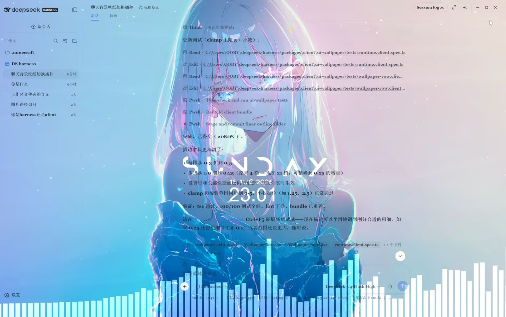

# dsh-chat-wallpaper

[DeepSeek Harness](https://github.com/deepseek-ai/deepseek-harness)（dsh）的聊天背景壁纸插件，以及配套的透明聊天窗口外壳。

## 功能

在 DeepSeek Harness 聊天界面背后铺满整窗壁纸；「桌面透明」模式下，配合透明 Electron 窗口，**系统桌面（包括壁纸引擎的实时渲染）直接透过聊天界面显示出来**。

### 壁纸来源

- **本地图片** —— 选择文件后自动压缩为有边界的 JPEG 数据 URL，重启后依然生效。
- **图片链接** —— 任意远程图片 URL。
- **壁纸引擎库** —— 扫描本地 Steam 创意工坊（`steamapps/workshop/content/431960`）与本地 `myprojects` 目录，通过回环 Web 服务以严格路径隔离提供白名单内的图片/视频；视频壁纸以静音、循环、铺满方式播放。
- **桌面透明** —— 不渲染任何壁纸层；界面表面变为半透明，窗口背后的系统桌面（或壁纸引擎实时场景）原样透出。

### 聊天文字控制

- **13 色文字色板**（墨黑、雪白、银灰、玫瑰金、香槟、天蓝、紫罗兰、薄荷、珊瑚、柠檬黄、海蓝、樱花粉、葡萄紫）—— 作用于**全部**聊天文字，而非仅气泡。
- **文字透明度**（0–100%）—— 文字与描边一起淡出。
- **白色描边**（0–5，0.25 步进）—— 任意壁纸上都能看清文字。
- **字体**（系统/衬线/等宽/圆体）与**字重**（400–800）。
- **代码背景开关** —— 在实况壁纸上碍眼时，隐藏 markdown 行内代码/代码块的背景。

### 透明聊天窗口（`tools/chat-desktop`）

加载 dsh 聊天界面的无边框透明 Electron 窗口：

- 一键清屏（F11 或标题栏的清屏按钮）：最小化所有其它窗口并隐藏桌面图标——**绝不杀程序**；再按 F11 恢复。
- 浏览器风格的标题栏按钮（清屏/最小化/最大化/关闭）；关闭窗口时恢复聊天窗口。
- 任务栏始终可见可用。

## 截图

聊天界面直接透出二次元壁纸的实拍效果——壁纸引擎的实况场景（或任意本地图片 / 链接）铺在对话背后，聊天文字带着白色描边浮于其上：



## 安装

> **给 AI 的快捷安装指令** —— 把下面整段粘贴给任意 AI 助手即可：
>
> ```text
> 安装 dsh-chat-wallpaper 插件（DeepSeek Harness 的聊天背景壁纸插件）：
> git clone https://github.com/deepseek-ai/deepseek-harness.git
> git clone https://github.com/PageChristine144/dsh-chat-wallpaper.git
> cp -r dsh-chat-wallpaper/packages/ui-wallpaper deepseek-harness/packages/client/ui-wallpaper
> cd deepseek-harness && pnpm install && npx tsdown --env.DSH_BUILD_FACE client && npx dsh web
> 完成后在 设置 → 聊天背景 中配置壁纸；「桌面透明」模式需要额外运行
> tools/chat-desktop（npm install && npm start）。
> ```

### 方式一：随 DeepSeek Harness 主仓库（推荐）

插件**内置于 dsh 主仓库**的 `packages/client/ui-wallpaper`，克隆 dsh 即可使用，无需额外安装步骤：

```sh
# 1. 前置要求：Node.js 18+ 与 pnpm
# 2. 克隆 dsh 主仓库（插件已包含在内）
git clone https://github.com/deepseek-ai/deepseek-harness.git
cd deepseek-harness
# 3. 安装依赖并构建客户端包
pnpm install
npx tsdown --env.DSH_BUILD_FACE client
# 4. 启动 dsh（其它启动方式见 dsh 主仓库 README）
npx dsh web
```

打开 **设置 → 聊天背景** 即可配置壁纸；对话头部也会出现一个快捷切换按钮。

### 方式二：从本仓库使用

本仓库是 **DSH Hub Profile Bundle**：仓库根目录带有标准的 `package.json`（声明 `dsh.bundle.patch` → `./cordis.patch.yml`）以及已提交的预构建 `lib/` 产物，可直接在 [DSH Hub](https://hub.omdsh.dev) 提交，或以 Profile Bundle 方式安装。开发仍在 dsh 工作区内进行：

```sh
git clone https://github.com/PageChristine144/dsh-chat-wallpaper.git
git clone https://github.com/deepseek-ai/deepseek-harness.git
# 将本包放到 dsh 期望的位置
cp -r dsh-chat-wallpaper/packages/ui-wallpaper deepseek-harness/packages/client/ui-wallpaper
cd deepseek-harness
pnpm install
npx tsdown --env.DSH_BUILD_FACE client
```

### 发布到 DSH Hub

根目录 `package.json` 声明了 Profile Bundle 契约（`dsh.bundle.patch` → `./cordis.patch.yml`），并提交了预构建的 `lib/` 运行时产物，因此**禁用安装脚本也能安装**。在 DSH Hub 的发布页面提交公开仓库地址即可；`lib/` 与 `cordis.patch.yml` 的重生成方式：在 dsh 工作区重新构建（`npx tsdown --env.DSH_BUILD_FACE client`），并把 `packages/client/ui-wallpaper/lib` 复制回仓库根目录。

### 透明聊天窗口（`tools/chat-desktop`）

「桌面透明」模式需要配套的 Electron 外壳。除 Electron 外无外部运行时依赖：

```sh
cd tools/chat-desktop
npm install   # 拉取 Electron
npm start     # 或从插件的「桌面透明」模式中启动
```

## 开发

本仓库是插件的**源码镜像 / 二创基础**：完整的构建与测试环境位于上游 dsh 工作区（`@deepseek-ai/*` 包已发布到 npm 的 `next` 通道，但插件针对 monorepo 的 workspace 版本开发）。

贡献者工作流：

```sh
# 1. 克隆 dsh，并将本仓库 packages/ui-wallpaper 覆盖到 packages/client/ui-wallpaper
git clone https://github.com/deepseek-ai/deepseek-harness.git
cp -r dsh-chat-wallpaper/packages/ui-wallpaper deepseek-harness/packages/client/ui-wallpaper

# 2. 在 dsh 工作区根目录执行安装依赖、类型检查、测试、打包
pnpm install
npx tsc -b tsconfig.client.json
npx vitest run packages/client/ui-wallpaper
npx tsdown --env.DSH_BUILD_FACE client
```

测试套件覆盖：运行时设置流程、DOM presenter（图层/墨色/描边/透明度/代码背景）、WE 宿主路由、设置与头部界面。

## 壁纸引擎集成说明

- 这是**非官方集成**。Wallpaper Engine 是 Valve 的商业软件；本插件仅读取你本地的素材目录并在本机执行命令，**不捆绑、不附带** WE，也不要求你购买——由你自己安装。
- 壁纸音频由**壁纸引擎自身设置**控制（例如「其他程序获得焦点时静音」）。插件保留一个便捷的声音开关用于记录你的意图，但不与 WE 界面对抗。
- 场景/网页壁纸回退为静态预览；插件核心体验是桌面透明的实况透出。

## 二创

本项目使用 **MIT 许可**——你可以自由 fork、修改、扩展、再分发，甚至在其上构建商业产品。仅两点小要求：

1. 保留原始 MIT 版权声明（见 [LICENSE](LICENSE)）。
2. 未经许可，不要借用 DeepSeek / 上游名称背书你的衍生品。

做出好东西的话，欢迎向上游提交 PR，或在 [dsh 社区](https://github.com/deepseek-ai/deepseek-harness/discussions) 分享——记得打上 `dsh-plugin` 标签！

## 许可证

[MIT](LICENSE) © 2026 DeepSeek。
